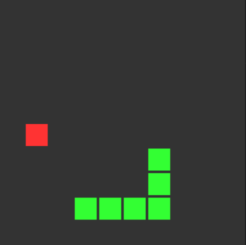

# Snake

Implementation of the classic snake game in C using modern OpenGL.  
OpenGL 4.6 recommended although it should work with 3.0+ as well with some minor tweaks in the code.  
For using in Linux, you'll have to make some more changes.  

`WASD` or arrow keys to start the game and move the snake  
`R` to restart in case of a gameover  
`Q` or `ESC` to quit  

###### developed by @krishna2803
